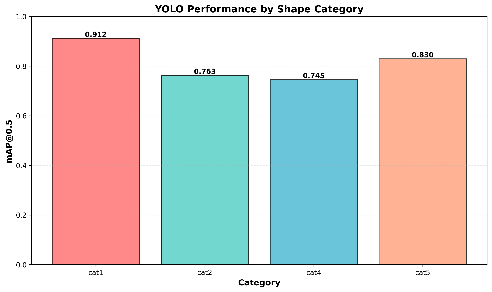
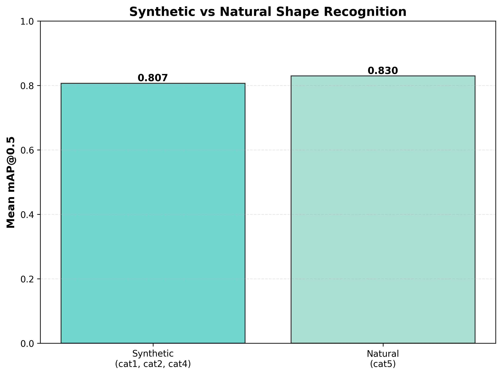

# YOLO Shape Recognition - Experiment Report

## Overview

This report presents the results of training YOLOv8 to recognize synthetic and natural shape silhouettes.

## Overall Performance

| Metric | Value |
|--------|-------|
| mAP@0.5 | 0.8124 |
| mAP@0.5:0.95 | 0.6461 |
| Precision | 0.8534 |
| Recall | 0.8048 |

## Per-Category Results

| Category | Type | mAP@0.5 | mAP@0.5:0.95 |
|----------|------|---------|---------------|
| cat1 | Synthetic (unconstrained) | 0.9118 | 0.6972 |
| cat2 | Synthetic (variance matched) | 0.7630 | 0.6251 |
| cat4 | Synthetic (all stats matched) | 0.7454 | 0.6012 |
| cat5 | Natural (animals) | 0.8296 | 0.6610 |

## Key Findings

1. **Synthetic shapes average mAP**: 0.8067
2. **Natural shapes mAP**: 0.8296
3. **Difference**: 0.0228

4. **Best performing category**: cat1 (mAP: 0.9118)
5. **Worst performing category**: cat4 (mAP: 0.7454)

## Visualizations

### Performance by Category

### Synthetic vs Natural Comparison

### Sample Predictions

## Conclusion

The trained YOLO model successfully detects and classifies shape silhouettes across all categories. Natural shapes showed better detection performance (0.8296) compared to synthetic shapes (0.8067).
