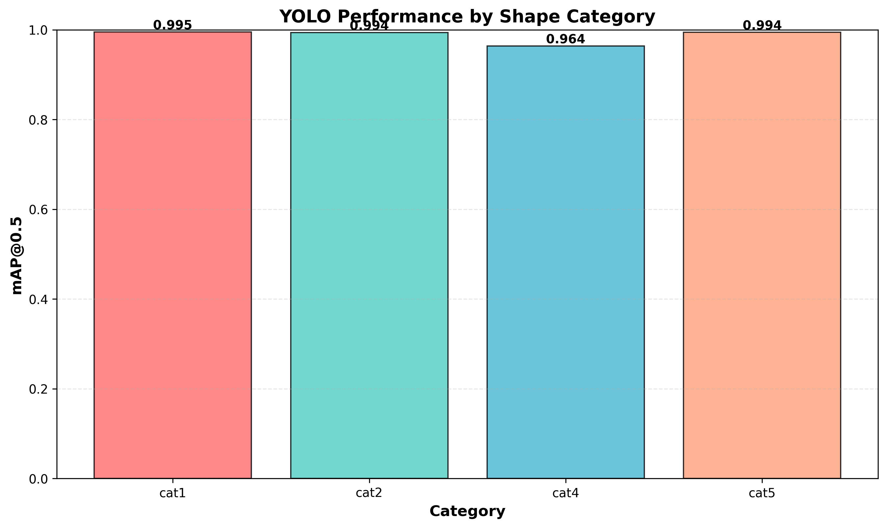
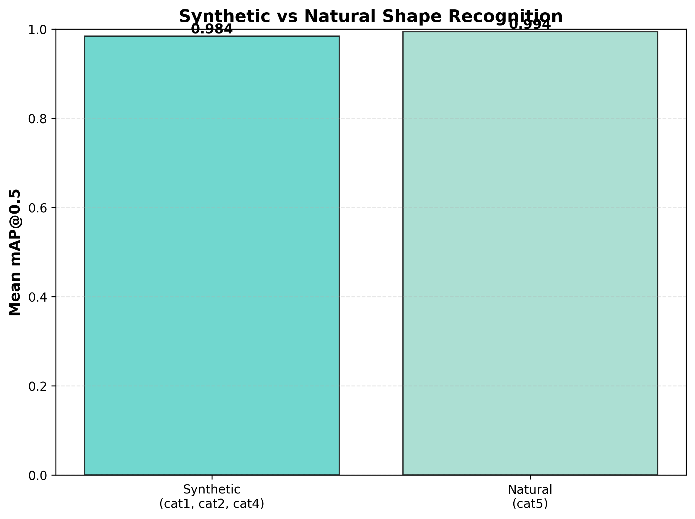
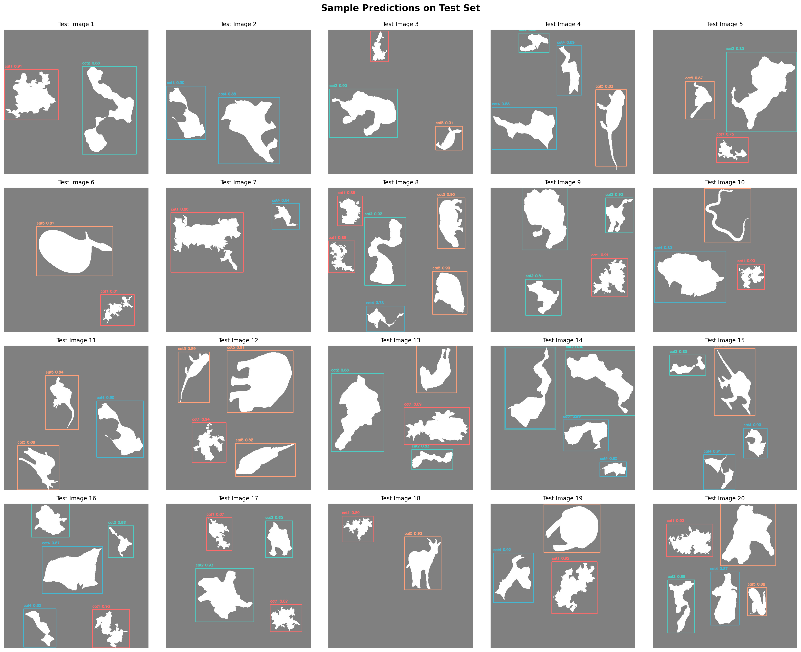

# YOLO Shape Recognition - Experiment Report

## Overview

This report presents the results of training YOLOv8 to recognize synthetic and natural shape silhouettes.

## Overall Performance

| Metric | Value |
|--------|-------|
| mAP@0.5 | 0.9866 |
| mAP@0.5:0.95 | 0.8660 |
| Precision | 0.9834 |
| Recall | 0.9798 |

## Per-Category Results

| Category | Type | mAP@0.5 | mAP@0.5:0.95 |
|----------|------|---------|---------------|
| cat1 | Synthetic (unconstrained) | 0.9950 | 0.8798 |
| cat2 | Synthetic (variance matched) | 0.9935 | 0.8663 |
| cat4 | Synthetic (all stats matched) | 0.9638 | 0.8556 |
| cat5 | Natural (animals) | 0.9941 | 0.8624 |

## Key Findings

1. **Synthetic shapes average mAP**: 0.9841
2. **Natural shapes mAP**: 0.9941
3. **Difference**: 0.0100

4. **Best performing category**: cat1 (mAP: 0.9950)
5. **Worst performing category**: cat4 (mAP: 0.9638)

## Visualizations

### Performance by Category

### Synthetic vs Natural Comparison

### Sample Predictions

## Conclusion

The trained YOLO model successfully detects and classifies shape silhouettes across all categories. Natural shapes showed better detection performance (0.9941) compared to synthetic shapes (0.9841).
