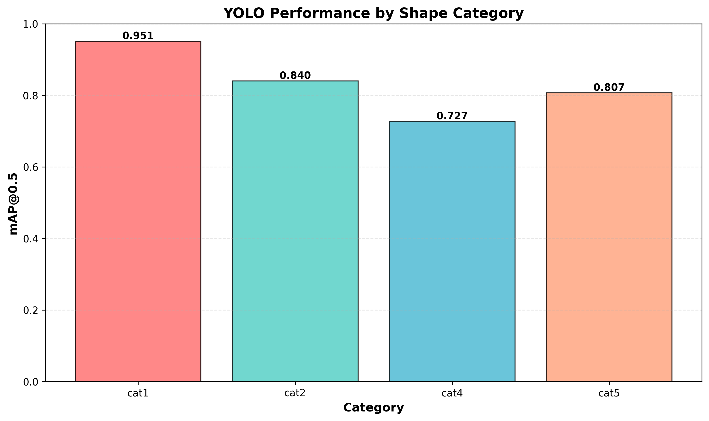
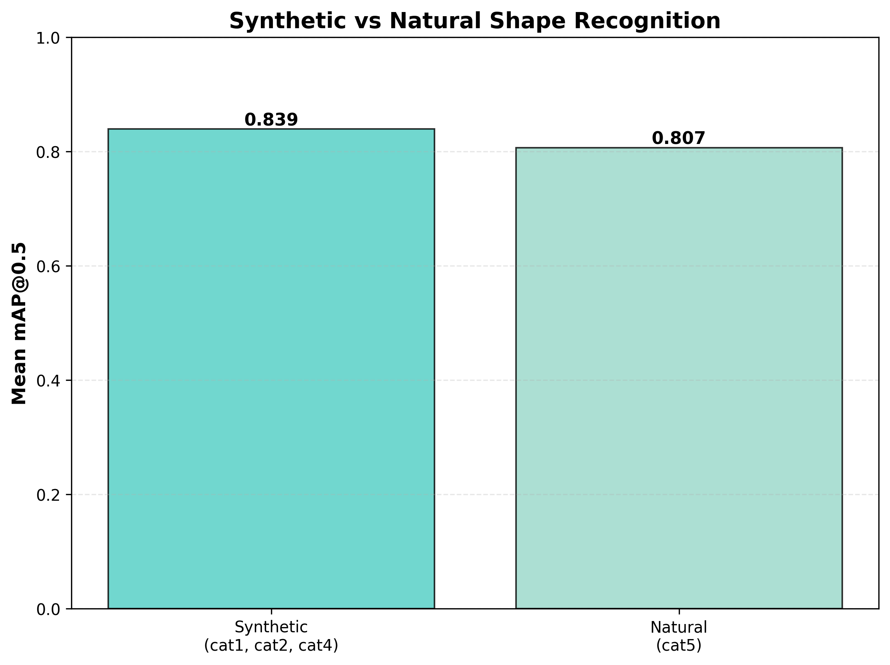
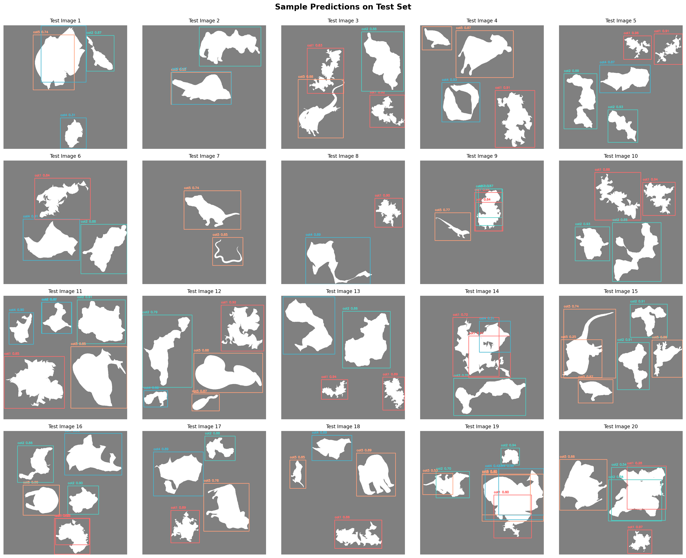

# YOLO Shape Recognition - Experiment Report

## Overview

This report presents the results of training YOLOv8 to recognize synthetic and natural shape silhouettes.

## Overall Performance

| Metric | Value |
|--------|-------|
| mAP@0.5 | 0.8311 |
| mAP@0.5:0.95 | 0.6543 |
| Precision | 0.8846 |
| Recall | 0.8219 |

## Per-Category Results

| Category | Type | mAP@0.5 | mAP@0.5:0.95 |
|----------|------|---------|---------------|
| cat1 | Synthetic (unconstrained) | 0.9512 | 0.7329 |
| cat2 | Synthetic (variance matched) | 0.8398 | 0.6664 |
| cat4 | Synthetic (all stats matched) | 0.7267 | 0.5817 |
| cat5 | Natural (animals) | 0.8067 | 0.6364 |

## Key Findings

1. **Synthetic shapes average mAP**: 0.8392
2. **Natural shapes mAP**: 0.8067
3. **Difference**: 0.0326

4. **Best performing category**: cat1 (mAP: 0.9512)
5. **Worst performing category**: cat4 (mAP: 0.7267)

## Visualizations

### Performance by Category

### Synthetic vs Natural Comparison

### Sample Predictions

## Conclusion

The trained YOLO model successfully detects and classifies shape silhouettes across all categories. Synthetic shapes showed better detection performance (0.8392) compared to natural shapes (0.8067), suggesting that controlled curvature properties may be more easily learned by the model.
