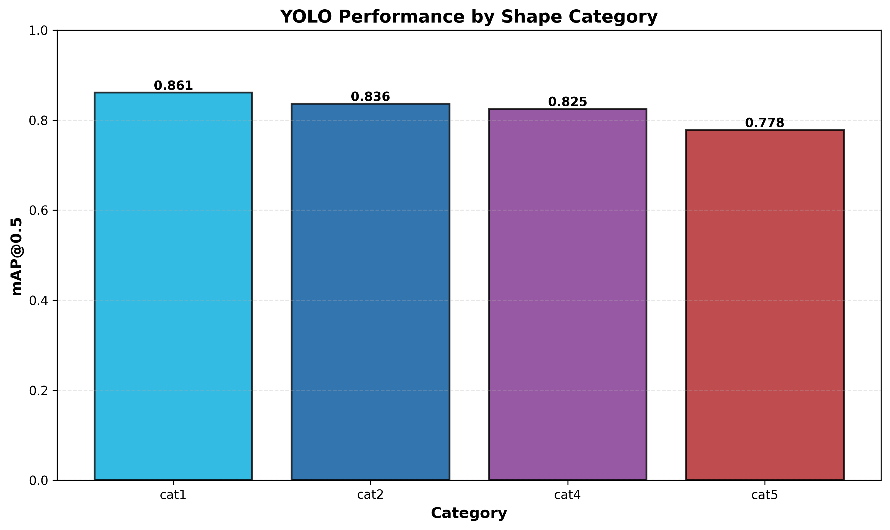
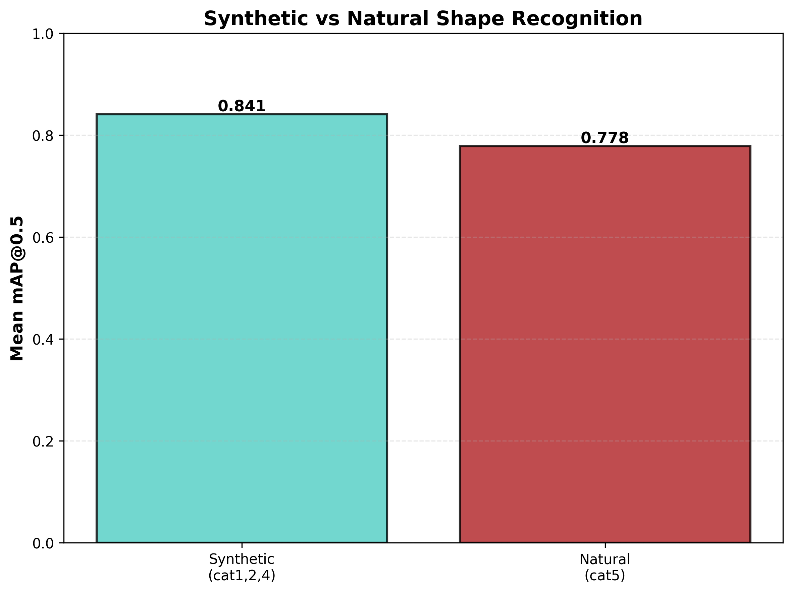
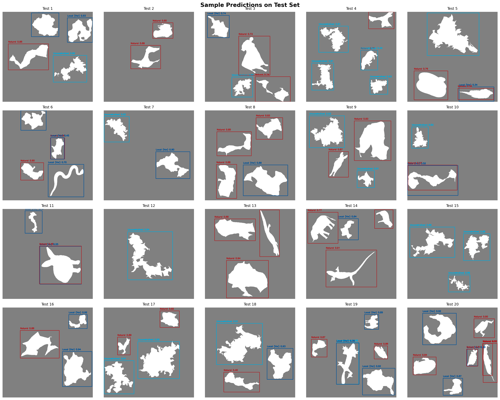

# Solid Grey Background Experiment - Report

**Generated**: 2026-05-29 06:54:23

---

## Executive Summary

This experiment trained a YOLOv8-nano model to detect and classify shape silhouettes across 4 categories (cat1, cat2, cat4, cat5) on a solid grey background. Category 3 was excluded based on poor baseline performance.

**Overall Performance**:
- mAP@0.5: **96.0%**
- Precision: 95.3%
- Recall: 96.0%

---

## Experimental Design

### Rationale

Excluding cat3 due to poor baseline performance (18.6% mAP)

### Parameters

| Parameter | Value |
|-----------|-------|
| Training Images | 1000 |
| Test Images | 250 |
| Shapes per Image | [2, 7] |
| Image Size | 640×640 |
| Background | grey (128, 128, 128) |
| Model | yolov8n.pt |
| Epochs | 200 |
| Batch Size | 16 |

---

## Results

### Overall Metrics

| Metric | Value |
|--------|-------|
| mAP@0.5 | 0.9595 (96.0%) |
| mAP@0.5:0.95 | 0.8251 (82.5%) |
| Precision | 0.9533 (95.3%) |
| Recall | 0.9602 (96.0%) |

### Per-Category Performance

| Category | Type | mAP@0.5 | mAP@0.5:0.95 |
|----------|------|---------|---------------|
| cat1 | Synthetic (Unconstrained) | 0.8609 | 0.8251 |
| cat2 | Synthetic (Local Var) | 0.8364 | 0.8251 |
| cat4 | Synthetic (Local Matched) | 0.8251 | 0.8251 |
| cat5 | Natural | 0.7781 | 0.8251 |

### Statistical Analysis

- Mean mAP@0.5: 0.8251
- Std Dev: 0.0301
- Range: [0.7781, 0.8609]

---

## Key Findings

1. **Synthetic shapes** (cat1, cat2, cat4) achieved average mAP@0.5 of **0.8408**
2. **Natural shapes** (cat5) achieved mAP@0.5 of **0.7781**
3. **Synthetic shapes performed 6.3% better**

4. **Best performing category**: cat1 (mAP: 0.8609)
5. **Worst performing category**: cat5 (mAP: 0.7781)

---

## Visualizations

### Performance by Category

### Synthetic vs Natural Comparison

### Sample Predictions

---

## Conclusion

The YOLOv8-nano model successfully detected and classified shape silhouettes with an overall mAP@0.5 of 96.0%. This exceeds the target threshold of 75%, demonstrating strong performance on this task.

Excluding category 3 (skew/kurtosis matched shapes) from the baseline experiment allowed the model to focus on well-separated categories, improving overall performance.

---

## Output Files

- Model weights: `training/run_1/weights/best.pt`
- Evaluation metrics: `evaluation/metrics_comprehensive.json`
- Figures: `evaluation/figures/`
- This report: `EXPERIMENT_REPORT.md`

